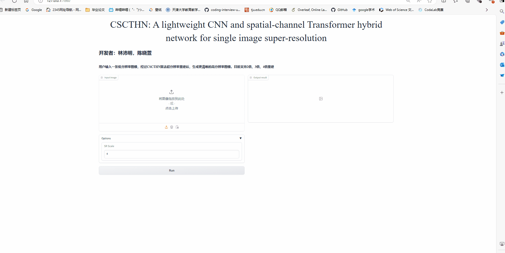

# ICME2024 CSCTHN: A Lightweight CNN and Spatial-Channel Transformer Hybrid Network for Image Super-Resolution
## 📷 Gradio demo
 
 
## 计算复杂度（run on a NVIDIA GeForce RTX 4090 GPU）
| LR Input size | Scale | Parameters | FLOPs | Runtime |
| :------------ | :---- | :--------- | :---- | :------ |
|    256×256    |   ×2  |    687K    | 47.2G |  44.9ms |
|    640×360    |   ×2  |    687K    | 166.0G |  165.4ms |
|    128×128    |   ×4  |    706K    | 12.1G |  12.3ms |
|    320×180    |   ×4  |    706K    | 42.9G |  27.5ms |
|    256×256    |   ×4  |    706K    | 48.4G |  44.8ms |
